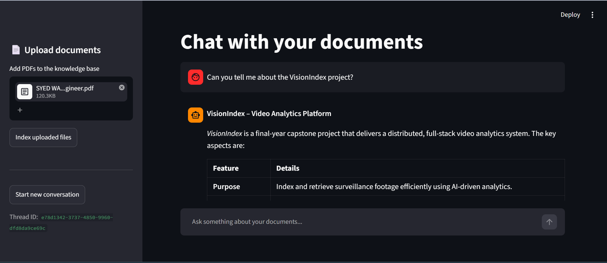

# 📚 DocuChat — RAG-Powered Document Chatbot

A full-stack Retrieval-Augmented Generation (RAG) chatbot that lets you upload PDF documents and have natural, context-aware conversations about their contents — complete with source attribution down to the exact page.

Built with a decoupled **FastAPI** backend and a **Streamlit** frontend, powered by **LangChain**, **LangGraph**, and **Groq's** blazing-fast LLM inference.

---

## 🖼️ Demo

<!--
  Drop your screenshot/GIF here. Recommended: a 1200px-wide PNG or GIF
  showing the chat interface with a document uploaded and an answer
  with its source citation visible.
-->



---

## ✨ Features

- **📤 Drag-and-drop document ingestion** — upload PDFs and Word (`.docx`) files directly from the sidebar; they're parsed, chunked, and embedded automatically, regardless of format.
- **🧠 Context-aware conversations** — powered by a LangGraph agent that decides *when* to search your documents instead of blindly retrieving on every message.
- **📌 Source-grounded answers** — every response is paired with the exact document (and, for PDFs, the page number) it was pulled from, so you can verify the answer yourself. Word documents don't carry fixed page numbers, so citations for `.docx` sources show the document name only.
- **💾 Persistent chat memory** — conversations are checkpointed to SQLite, so context survives across turns within a thread.
- **🔄 Incremental indexing** — new documents are added to the existing vector index without rebuilding it from scratch.
- **⚡ Lightweight embeddings** — uses ONNX-based FastEmbed instead of PyTorch, keeping memory usage low enough to run comfortably on free-tier hosting.
- **🧩 Fully modular backend** — each concern (config, ingestion, vector store, tools, agent, API) lives in its own file, making the codebase easy to navigate and extend.
- **Supported file types:** `.pdf`, `.docx`

---

## 🏗️ Architecture

```
                    ┌──────────────────────┐
                    │   Streamlit Frontend │
                    │       (app.py)       │
                    └──────────┬───────────┘
                               │ HTTP (REST)
                               ▼
                    ┌──────────────────────┐
                    │   FastAPI Backend    │
                    │      (main.py)       │
                    └──────────┬───────────┘
             ┌─────────────────┼─────────────────┐
             ▼                 ▼                 ▼
     ┌───────────────┐ ┌───────────────┐ ┌───────────────┐
     │  ingestion.py │ │ vectorstore.py│ │    agent.py   │
     │  PDF → chunks │ │ FAISS + embed │ │  LLM + memory │
     │  ingestion.py │ │ vectorstore.py│ │    agent.py   │
     │ Docs → chunks │ │ FAISS + embed │ │  LLM + memory │
     └───────────────┘ └───────────────┘ └────────┬──────┘
                                                  │
                                          ┌───────▼────────┐
                                          │    tools.py    │
                                          │ search_document│
                                          └────────────────┘
```

**Flow:**
1. A PDF or Word document is uploaded through the Streamlit UI → sent to `/upload`.
2. `ingestion.py` detects the file type and partitions it into semantically meaningful chunks via `unstructured` (layout-aware for PDFs, native structure-aware for `.docx`), with table detection either way.
3. `vectorstore.py` embeds the chunks (FastEmbed) and indexes them in FAISS.
4. A user message hits `/chat` → a LangGraph agent (`agent.py`) decides whether to call the `search_documents` tool (`tools.py`).
5. Retrieved chunks are grounded into the LLM's response, and the top-scoring source is returned alongside the answer.

---

## 🛠️ Tech Stack

| Layer            | Technology |
|------------------|------------|
| Frontend         | Streamlit |
| Backend API      | FastAPI |
| Agent framework  | LangChain + LangGraph |
| LLM inference    | Groq (`llama-3.1-8b-instant`) |
| Embeddings       | FastEmbed (`BAAI/bge-small-en-v1.5`, ONNX runtime) |
| Vector store     | FAISS |
| Document parsing | Unstructured (`partition` auto-detects file type — hi-res + table detection for PDFs, native structure parsing for `.docx`) 
| Conversation memory | SQLite (via LangGraph's `SqliteSaver`) |

---

## 📁 Project Structure

```
.
├── .env                   # shared env vars — both backend and frontend read from 
|
├── backend/
│   ├── config.py          # Paths, env vars, constants
│   ├── vectorstore.py     # Embeddings + FAISS index management
│   ├── ingestion.py       # Document upload handling + chunking (PDF, DOCX)
│   ├── tools.py           # Agent tool: search_documents
│   ├── agent.py           # LLM, checkpointer, agent construction
│   ├── models.py          # Pydantic request/response schemas
│   ├── main.py            # FastAPI app + routes
│   └── requirements.txt
│
└── frontend/
    ├── app.py             # Streamlit chat interface
    └── requirements.txt
```

---

## 🚀 Getting Started

### Prerequisites
- Python 3.10+
- A [Groq API key](https://console.groq.com)

### 1. Clone the repo
```bash
git clone https://github.com/WasifAliShah/PDF-RAG-chatbot.git
cd PDF-RAG-chatbot
```

### 2. Configure environment variables
Create a single `.env` file at the **project root** (the folder containing both `backend/` and `frontend/`):
```env
GROQ_API_KEY=your_groq_api_key_here
BACKEND_URL=http://localhost:8000
```
Both the backend and frontend read from this same file — `python-dotenv`'s `load_dotenv()` walks up from the current working directory until it finds a `.env`, so this works automatically as long as you launch each app from inside its own folder as shown below.

### 3. Set up the backend
```bash
cd backend
python -m venv venv
source venv/bin/activate      # Windows: venv\Scripts\activate
pip install -r requirements.txt
uvicorn main:app --reload
```
The backend will run at `http://localhost:8000`.

### 4. Set up the frontend
In a new terminal:
```bash
cd frontend
python -m venv venv
source venv/bin/activate      # Windows: venv\Scripts\activate
pip install -r requirements.txt
streamlit run app.py
```
Visit `http://localhost:8501` in your browser.

---

## 🔌 API Reference

| Method | Endpoint   | Description |
|--------|------------|--------------|
| `POST` | `/upload`  | Upload one or more PDF or Word (`.docx`) documents to be parsed, chunked, and indexed |
| `POST` | `/chat`    | Send a message + `thread_id`; returns an answer and its source |
| `GET`  | `/health`  | Health check — reports whether an index has been built |

**Example: `/chat` request**
```json
{
  "message": "What does the document say about onboarding?",
  "thread_id": "a1b2c3d4"
}
```

**Example: `/chat` response**
```json
{
  "answer": "According to the document, onboarding takes place over the first two weeks...",
  "source": "employee_handbook.pdf, page 4"
}
```

---

<!-- ## 🧭 Roadmap

- [ ] Swap module-level globals for FastAPI dependency injection / `app.state`
- [ ] Add `pydantic-settings` for validated configuration
- [ ] Split routes into `APIRouter`s as the API grows
- [ ] Add automated tests for ingestion and retrieval
- [ ] Docker Compose setup for one-command startup
- [ ] Deploy demo (Render / Railway + Streamlit Cloud) 

---
-->

## 📄 License

This project is open source and available under the [MIT License](LICENSE).